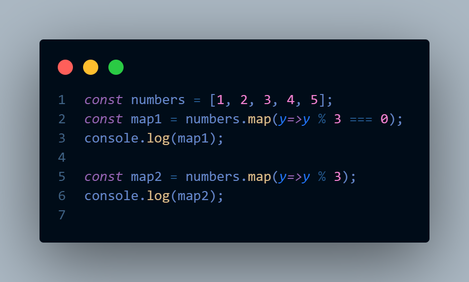
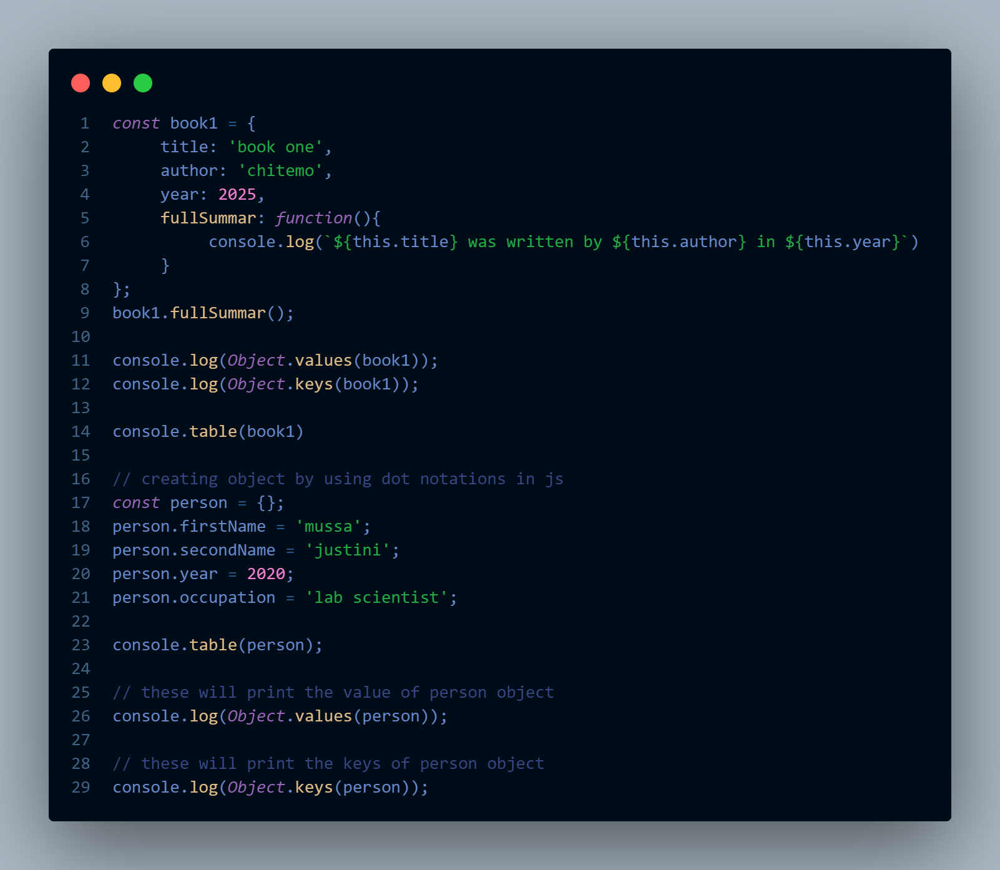

                      #MARKDOWN LEARNING.

#Heading One.
##Heading Two.
###Heading Three.
####Heading Four.


#Heading One 
This is the heading one paragraph.

The paragraph in the markdown it is separated by the empty line in the file.

Markdown it is the simple/lightweight markup language which is plain text formatting used by the developers(mostly).

Markdown it is the file in the repository its is the first file seen to your project. Also it is end with the .md extension 

*This is an italic style*

The two ways to make your text an italic is by wrapping your text with one star/underscore

consider the example below 
*This is an italic text style by using the star wrapping*

_This is an italic text style by using an underscore_

bolding text in the markdown 
If you want to bold your text in the markdwon you should wrap your text with double stars/double underscore.

**This is the bolded text in the md**
__also you can use double underscore to bold your text in the md.__

Such that if you want both bold and italic simultenousy use three stars(asterisks)/underscores.
***This is bolded and italized at the same time by using three asterisks(stars)/underscore***
___by using underscore___

Strikethrough
use tildes on both side to stringthrough your words or phrases
~~This is strikingThrough the words or phrases by using tildes on both side~~

Links 
To links to the external website uses two set of the brackets which are squire bracket [link text] and the parenthesis to put URL.
Example below 
[Google](www.google.com);

[Markdown Study](index.html);

Image in the markdwon 
begins with the exclamation followed by the squire bracket with the alt text such as:
;

[Email](mussajust5@gmail.com);

For image
This is an object snapcode


Make sure that in inserting image in the markdown there is no space between exclamation, squire bracket and parenthesis.

Lists in the markdown 
 There are two types of lists which are ordered and unordered lists.

Unordered List
In the unordered list you can use either, stars, hyphen or plus sign any of them you can use and it will bring the same results. Consider the example below 

Markdown include the following contents which are
 -Title of the project.
 -Descriptions of the project.
 -Motivation of why you have build such kind of the project.
 -Markdown should answer the question of why, how and what since it is the first thing to be seen on your repository.
 -The problems solved by using project.
 -Language/frameworks/library used to build your project.
 -Also helps to the users to know your documentations skills.
 -Lisence.
 -Conclusion.

Ordered List: This is by using numbers, consider the example below which is as the following
1.My name is Mussa.
2.I come from Tanzania.
3.Frontend and Weekend developer.

Table in the markdown 

##ALERTS
You can use the alerts in the markdown, but this are the rendered with the special color, during the use of alert make sure you are using at once to avoid the overload of the leader, some of the alerts used in the markdwon includes TIP, COUTION, IMPORTANT & WARNING.
In writting the alerts in the markdown always start with the greater symbol followed by the squire bracket and inside the squire bracket you should start with the exclamation consider example below.

>[!TIP]
>This is tip alert in the markdown.

>[!IMPORTANT]
>This is an important alert in the markdown.

>[!WARNING]
>Also thi is the warning alert in the markdown.

>[!COUTION]
>This is the coution alert in the markdown.

Comments in the markdown
Also you can hide he content in the markdown by commenting it, consinder the example below.

<!-- This content will not appear It's hided by commenting It -->

name|age|location
-----------------
musa|27|gairo

This is <sub>subscript</sub>

This is <sup>superscript</sup>

Also you can mention people in the markdown such as @Mussa-Chitemo.
:EMOJICODE:


>This is blockquotes.

You can include the blcok of code by using three backtick as the following.
```JavaScript

  function myFunction(name){
     return console.log(`My name is ${name}`)
  }
 myFunction(mussa)```

XXXXXXXXX MY name is mussa XXXXXXX
